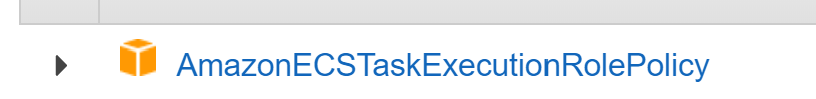

# AWS Fargate Deployment

-   [Create ECR Repository](#AWSFargateDeployment-CreateECRRepository)
-   [Download CxFlow](#AWSFargateDeployment-DownloadCxFlow)
-   [Configure CxFlow](#AWSFargateDeployment-ConfigureCxFlow)
-   [Build Docker Image](#AWSFargateDeployment-BuildDockerImage)
-   [Create SSM
    Parameters/Secrets](#AWSFargateDeployment-CreateSSMParameters/Secrets)
-   [Define ECS IAM
    Roles/Permissions](#AWSFargateDeployment-DefineECSIAMRoles/Permissions)
-   [Define ECS Task
    Definition](#AWSFargateDeployment-DefineECSTaskDefinition)
-   [Create Service](#AWSFargateDeployment-CreateService)
-   [CxFlow Security Groups](#AWSFargateDeployment-CxFlowSecurityGroups)
-   [Monitoring](#AWSFargateDeployment-Monitoring)

## Create ECR Repository

<https://docs.aws.amazon.com/AmazonECR/latest/userguide/repository-create.html>

The below assumes a repository called cxflow

## Download CxFlow

Grab the latest binary from the following:

<https://github.com/checkmarx-ts/cx-flow/releases/latest>

Download the jar file (cx-flow-1.5.3.jar for example - note there is a
JDK 11 version as well - cx-flow-11-1.5.3.jar)

## Configure CxFlow

Configure CxFlow as per the custom deployment needs. [See details
here](https://checkmarx.atlassian.net/wiki/spaces/PTS/pages/1276641334/CxFlow+Configuration).

The configuration should be completed using a file named
application.yml. Keep the JAR for CxFlow and the configuration
(application.yml) file in the same directory

A base configuration can be found here for 8.9 and 9.0 (default bug
tracker is Azure in this example, but can be changed) - *rename 9.0
version to application.yml*:

[](/wiki/download/attachments/1503954264/application.yml?version=2&modificationDate=1581298053198&cacheVersion=1&api=v2)[](/wiki/download/attachments/1503954264/application%5B9.0%5D.yml?version=2&modificationDate=1581298053232&cacheVersion=1&api=v2)

Note: This step should be completed specific to a client’s
requirements/use cases (scanning/branching criteria, result feedback,
result filtering policy).

## Build Docker Image

Use the following as a base Docker file

[](/wiki/download/attachments/1503954264/Dockerfile?version=1&modificationDate=1581292876979&cacheVersion=1&api=v2)

Build the image, and tag it for ECR and push to the remote repository
(as created in previous step)

``` java
$(aws ecr get-login --no-include-email --region us-east-1)
docker build -t cxflow .
docker tag cxflow XXXXXXXXXX.dkr.ecr.us-east-1.amazonaws.com/cxflow
docker push XXXXXXXXXX.dkr.ecr.us-east-1.amazonaws.com/cxflow
```

Note: `XXXXXXXXXX` is the AWS account, and this example is using the
**us-east-1 region.** *This image is by default tagged/pushed as latest
unless specified*

## Create SSM Parameters/Secrets

There are several SSM parameters (mainly secure SSM parameters). Feel
free to give different naming patterns, but remember to reflect the
changes in the ECS task definition as well as the IAM policy references.
These are the commands for using the AWS CLI and are leveraging the base
KMS key. Please refer to SSM documentation for variations. Console
configuration is also possible.

``` bash
#Checkmarx User
aws ssm put-parameter --name "/cxflow/checkmarx/username" --value "admin" --type SecureString

#Checkmarx Password
aws ssm put-parameter --name "/cxflow/checkmarx/password" --value "XXXXXX" --type SecureString

#It is worth noting that this below reference will result in what the url resolves.  Go into the console and update if required (validate this)
aws ssm put-parameter --name "/cxflow/checkmarx/url" --value "https://cx.local" --type String

#This token is associated with the default endpoint for driving a scan/results but that is not also associated with a 
#webhook event payload (which is a separate token as per below)
aws ssm put-parameter --name "/cxflow/token" --value "XXXXXX" --type SecureString

#Preshared secret between GitHub and CxFlow - used when registering the webhook for auth 
aws ssm put-parameter --name "/cxflow/github/webhook-token" --value "XXXXXX" --type SecureString

#GitHub Service account API token (Personal access token) used for driving git scanning in Checkmarx
#posting MD comments in PRs, Updating statuses, Creating GitHub issues (if applicable)
aws ssm put-parameter --name "/cxflow/github/token" --value "XXXXXX" --type SecureString

#Preshared secret between GitLab and CxFlow - used when registering the webhook for auth 
aws ssm put-parameter --name "/cxflow/gitlab/webhook-token" --value "XXXXXX" --type SecureString

#GitLab Service account API token used for driving git scanning in Checkmarx
#posting MD comments in MRs, Creating GitLab issues (if applicable)
aws ssm put-parameter --name "/cxflow/gitlab/token" --value "XXXXXX" --type SecureString

#Same pattern as above for GitHub/GitLab, instead for Azure DevOps and BitBucket
aws ssm put-parameter --name "/cxflow/azure/webhook-token" --value "<user>:XXXXXX" --type SecureString
aws ssm put-parameter --name "/cxflow/azure/token" --value "XXXXXX" --type SecureString
aws ssm put-parameter --name "/cxflow/bitbucket/webhook-token" --value "XXXXXX" --type SecureString
aws ssm put-parameter --name "/cxflow/bitbucket/token" --value "<use>:XXXXXX" --type SecureString
```

Note: Using SSM will avoid the use of any unencrypted credentials and
will be automatically injected into the CxFlow process.

## Define ECS IAM Roles/Permissions

ECS will need appropriate access to IAM resources including SSM
Parameters, KMS key, Cloud Watch log streams, ECR registry as well as
must be able to be assumed.

The trust policy must be defined as the following to allow this:

``` java
{
  "Version": "2012-10-17",
  "Statement": [
    {
      "Sid": "",
      "Effect": "Allow",
      "Principal": {
        "Service": "ecs-tasks.amazonaws.com"
      },
      "Action": "sts:AssumeRole"
    }
  ]
}
```

Note: The Role must be associated with ECS and Container Service
Definition.


The role should contain the base managed policy of
**AmazonECSTaskExecutionRolePolicy** to ensure proper access is given to
base ECS resources from within task execution.



Additional IAM policy is used to drive the above mentioned SSM
parameters / KMS keys, Cloudwatch logs, etc. This can be used as a
starting point but should be adjusted or restricted further based on
specific needs (i.e. log event groups/streams can be narrowed
appropriately):

``` java
{
  "Version": "2012-10-17",
  "Statement": [
    {
      "Effect": "Allow",
      "Action": [
        "ssm:GetParameter",
        "ssm:GetParametersByPath",
        "ssm:GetParameters",
        "kms:Decrypt"
      ],
      "Resource": [
        "arn:aws:ssm:us-east-1:<Acct ID>:parameter/cxflow/*",
        "arn:aws:kms:us-east-1:<Acct ID>:key/<KMS Key ID>"
      ]
    },
    {
      "Effect": "Allow",
      "Action": [
        "ecr:GetAuthorizationToken",
        "ecr:BatchCheckLayerAvailability",
        "ecr:GetDownloadUrlForLayer",
        "ecr:BatchGetImage",
        "logs:CreateLogStream",
        "logs:PutLogEvents"
      ],
      "Resource": "*"
    }
  ]
}
```

## Define ECS Task Definition

The following ECS Task Definition can be used to define the CxFlow Task
and inject the appropriate ENV variables linked from SSM Secure
Parameters (note the secrets section - there are direct links to the ssm
parameter paths as defined within the same region and the ENV variables
that will be inject/expected in CxFlow) - also note the log definition
that will send output to cloudwatch logs:

fargate.json

``` java
{
  "containerDefinitions": [{
    "portMappings": [{
        "hostPort": 8080,
        "containerPort": 8080,
        "protocol": "http"
      }],
      "essential": true,
      "name": "cxflow-container",
      "image": "XXXXXXXXXXXX.dkr.ecr.us-east-1.amazonaws.com/cxflow:latest",
      "logConfiguration": {
        "logDriver": "awslogs",
        "options": {
          "awslogs-group": "/app/cxflow",
          "awslogs-region": "us-east-1",
          "awslogs-stream-prefix": "cx-"
        }
      },
      "secrets": [{
        "name": "CHECKMARX_USERNAME",
        "valueFrom": "/cxflow/checkmarx/username"
      },
      {
        "name": "CHECKMARX_PASSWORD",
        "valueFrom": "/cxflow/checkmarx/password"
      },
      {
        "name": "CHECKMARX_BASE_URL",
        "valueFrom": "/cxflow/checkmarx/url"
      },
      {
        "name": "CX_FLOW_TOKEN",
        "valueFrom": "/cxflow/token"
      },
      {
        "name": "GITHUB_TOKEN",
        "valueFrom": "/cxflow/github/token"
      },
      {
        "name": "GITHUB_WEBHOOK_TOKEN",
        "valueFrom": "/cxflow/github/webhook-token"
      },
      {
        "name": "AZURE_TOKEN",
        "valueFrom": "/cxflow/azure/token"
      },
      {
        "name": "AZURE_WEBHOOK_TOKEN",
        "valueFrom": "/cxflow/azure/webhook-token"
      },
      {
        "name": "GITLAB_TOKEN",
        "valueFrom": "/cxflow/gitlab/token"
      },
      {
        "name": "GITLAB_WEBHOOK_TOKEN",
        "valueFrom": "/cxflow/gitlab/webhook-token"
      },
      {
        "name": "BITBUCKET_TOKEN",
        "valueFrom": "/cxflow/bitbucket/token"
      },
      {
        "name": "BITBUCKET_WEBHOOK_TOKEN",
        "valueFrom": "/cxflow/bitbucket/webhook-token"
      }]
    }
  ],
  "networkMode": "awsvpc",
  "executionRoleArn": "arn:aws:iam::XXXXXXXXXX:role/ecsTaskExecutionRole",
  "taskRoleArn": "arn:aws:iam::XXXXXXXXXXX:role/ecsTaskExecutionRole",
  "memory": "2048",
  "cpu": "512",
  "requiresCompatibilities": [
    "FARGATE"
  ],
  "family": "cxflow"
}
```

*The following command can be used to define the task definition within
ECS (using AWS CLI):*

``` bash
aws ecs register-task-definition --cli-input-json file://fargate.json
```

## Create Service

To create a service to run the defined task the following can be
leveraged:

``` bash
aws ecs create-service --cluster FieldDevelopment --service-name cxflow-service --task-definition cxflow:1 --desired-count 1 --launch-type "FARGATE" --network-configuration "awsvpcConfiguration={subnets=[subnet-XXXXXX],securityGroups=[sg-XXXXXX,sg-XXXXXXX], assignPublicIp=ENABLED}"
```

Note: The --task-definition \# (i.e. cxflow:1) is linked directly with
the current version, which is applicable to the number of times the
definition has been revised.

This command should be tailored to the specific use case. Specifically,
network architecture must be considered (awsvpcConfiguration). The above
assigns a Public IP directly, which will not be appropriate for most (if
not all) deployments. This should consider any ALB, NGINX and other
containers within the orhestration.

## CxFlow Security Groups

CxFlow should NOT be exposed directly on the internet without
considering the requirements for connectivity.

GitHub, Azure DevOps, Bitbucket all have IP CIDR ranges that can be
referenced for white-listing:

GitHub:
<https://help.github.com/en/github/authenticating-to-github/about-githubs-ip-addresses>

Azure:
<https://docs.microsoft.com/en-us/azure/devops/organizations/security/allow-list-ip-url?view=azure-devops>

BitBucket:
<https://confluence.atlassian.com/bitbucket/what-are-the-bitbucket-cloud-ip-addresses-i-should-use-to-configure-my-corporate-firewall-343343385.html>

On-premise architecture and security controls should be reviewed and
implemented on a per-customer basis.

GitLab does not have a defined CIDR range and must be considered with
caution

CxFlow should be placed into a network zone / DMZ that does not have any
network access beyond required connectivity points.

## Monitoring

Actuator endpoint can be used to monitor whether the service is up /
online:

[http://cxflow.XXXXX:8080/actuator/health](http://cxflow.XXXXX.com:8080/actuator/health)

``` java
{
"status": "UP"
}
```

Note: Actuator can be leveraged for many other monitoring purposes:

<https://docs.spring.io/spring-boot/docs/current/reference/html/production-ready-features.html>

## Attachments:


[Dockerfile](attachments/1503954264/1503954280)
(application/octet-stream)  

[image-20200210-002132.png](attachments/1503954264/1503954303.png)
(image/png)  

[image-20200210-002252.png](attachments/1503954264/1503954311.png)
(image/png)  

[fargate.json](attachments/1503954264/1504216569.json)
(application/json)  

[application\[9.0\].yml](attachments/1503954264/1503987110.yml)
(application/octet-stream)  

[application.yml](attachments/1503954264/1503987099.yml)
(application/octet-stream)  

[application.yml](attachments/1503954264/1503987092.yml)
(application/octet-stream)  

[application\[9.0\].yml](attachments/1503954264/1503987086.yml)
(application/octet-stream)  
