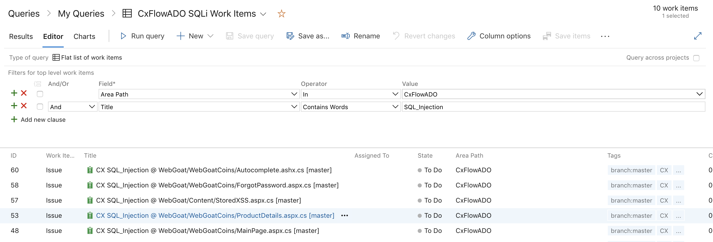

# Azure DevOps Webhook Lab

**Lab Goals**

This lab is designed to teach the following topics:

-   How to Commit & Push code changes using Visual Studio Code

-   How to scan on a Merge Request to a Protected Branch

-   How to scan on a Push to Protected Branch

-   Azure Work Item creation on a Push to Protected Branch

-   Update, Open or Close tickets from Batch mode via CLI

**CxFlow Prep**

-   Everything should be performed on the same machine that the CxSAST
    Manager is running for this lab

    -   Alternatively, do this on your local machine and change
        checkmarx base-url: in the .yml file to something that Azure
        DevOps can reach example:
        <https://cxprivatecloud.checkmarx.net/>

-   Create a new folder in C:\\ called CxFlow and download the latest
    CxFlow .jar for JDK 8 into this folder from
    <https://github.com/checkmarx-ts/cx-flow/releases>

    -   The current release of this lab guide =  cx-flow.1.5.4.jar

-   Download the latest windows version of ngrok from
    <https://ngrok.com/download> & unzip to C:\\CxFlow without the
    containing folder

-   Create a new file called application-azure.yml in C:\\CxFlow with
    the text at the bottom of the page and replace any values surrounded
    in \#\#\#\<\>\#\#\# with your appropriate values

-   Go over all of the config items and read what they do

    -    [CxFlow Configuration](CxFlow_Configuration)

-   Start Ngrok by opening a CMD prompt and typing the following

``` java
cd C:\CxFlow
ngrok http 8982
```

Ngrok also tunnels traffic on port 443 for SSL. We will be using this
for Azure DevOps webhooks since the endpoint is required to be https.

**Azure DevOps Prep**

-   Sign in with your Checkmarx email at
    <https://azure.microsoft.com/en-us/services/devops/>

-   Create a new organization if one does not already exist

-   Create a new private project called CxFlowADO

    -   Make sure repo type is Git under Advanced

-   Click Repos & Import code from your favorite small demo codebase on
    GitHub

    -   This lab will use - https://github.com/jerryhoff/WebGoat.NET

-   Create a token by clicking your profile in upper right corner \>
    Personal Access Tokens

    -   Give the token a name and change Expiration to Custom defined
        and set to a year

    -   Give the token full access to Work Items, Code, Build, Release

    -   Copy this token and keep safe - it should be pasted into the
        token: \<\> of the application-azure.yml

-   After .YML file is completely filled out and saved

-   Start CxFlow in webhook mode by opening a CMD prompt and typing the
    following

``` java
cd C:\CxFlow
java -jar cx-flow-1.5.4.jar --spring.config.location="C:\CxFlow\application-azure.yml" --web
```

-   Create a webhook by selecting in the upper left corner Azure DevOps
    & select the new repo you just created

    -   [WebHook Registration](WebHook_Registration)

-   Create a Webhook for Merge Requests

-   Click Project Settings \> Service hooks \> Create subscription and
    fill in details

    -   Click WebHooks then Next

        -   Change drop down to **Pull request created**

        -   Repository = CxFlowADO

        -   Branch = master

        -   URL = **https://\<cxflow\>/ado/pull **\| \<cxflow\> is https
            ngrok location of cxflow that is running

            -   example:
                [https://4d91e7ed.ngrok.io](http://4d91e7ed.ngrok.io)/ado/pull

        -   Basic authentication username = webhook-token: left side of
            : from .yml file - example: cxflow

        -   Basic authentication password = webhook-token: right side of
            : from .yml file - example: 12345

    -   Click Test and a green check should appear, then click Finish

-   Create a Webhook for Push to Master

    -   Click Project Settings \> Service hooks \> Create subscription
        and fill in details

    -   Click Web Hooks then Next

        -   Change drop down to Code pushed

        -   Repository = CxFlowADO

        -   Branch = master

        -   URL = **https://\<cxflow\>/ado/push **\| \<cxflow\> is https
            ngrok location of cxflow that is running

            -   example:
                [https://4d91e7ed.ngrok.io](http://4d91e7ed.ngrok.io)/ado/push

        -   Basic authentication username = webhook-token: left side of
            : from .yml file - example: cxflow

        -   Basic authentication password = webhook-token: right side of
            : from .yml file - example: 12345

    -   Click Add Webhook

**Triggering CxFlow from a Push to a protected branch (master)**

-   Open your favorite IDE of choice and clone the new repo

    -   This lab will use VS Code & the repo -
        `https://SamQuakenbush@dev.azure.com/SamQuakenbush/CxFlowADO/_git/CxFlowADO`

        -   VS Code download - <https://code.visualstudio.com/download>

        -   Select View\>Command Pallete - remember this shortcut

        -   Type git:clone and enter the your ADO URL

        -   Use the token created earlier for your password & click Open
            after the clone

-   Open [README.md](http://README.md) and add the following line & save

    -   CxFlowMasterPush-Test1

-   Commit to local git repo & push to origin with comments by entering
    the following in the command palette

    -   git:commit - always stage changes

        -   message = Cxflow push to a protected branch

    -   git:push

-   You show now see a scan in the CxSAST queue

    -   Notice the project name = RepoName-Branch

    -   Notice the team of the new project = ADO team name

        -   This is due to the team line in the .yml file - it
            auto-creates a team if it does not exist

        -   This can be overridden and changed in the configs

-   Once the scan finishes you should see work items in the Boards\>Work
    items tab in the project

-   To view all tickets you can create a new query view

    -   Click Open in Queries\>Editor & edit the following for each
        entry

    -   Clause 1

        -   Field = Area Path

        -   Operator = In

        -   Value = CxFlowADO

    -   Clause 2 - And

        -   Field = Title

        -   Operator = Contains Words

        -   Value = SQL\_Injection

<!-- -->

-   Run to the query to be sure it works and then Save Query

-   You can now see all the SQLi work items by selecting Boards\>Queries
    & the query you just created

-   Examine the following issue CX SQL\_Injection @
    WebGoat/WebGoatCoins/ProductDetails.aspx.cs \[master\]

-   Open the Checkmarx link and examine the finding



CxFlow only shows the source file of the vulnerability - using the
viewer is key to remediation

**Triggering CxFlow from a Pull Request to a protected branch
(security-fix to master)**

-   Open VSCode and create a new local branch called security-fix using
    the command palette

    -   git:create branch

        -   Branch name = security\_fix

-   Open MySqlDbProvider.cs underneath the Webgoat/App\_Code/DB folder
    and replace lines 415-417 with the following

``` java
sql = "select * from Products where productCode = @productCode";
MySqlCommand command = new MySqlCommand(sql, connection);
command.Parameters.AddWithValue("@productCode", productCode);
```

There is another concatenated product Code on line 419 that will be
important later. Do not fix this.

-   Add the following on line 9 to import the correct package

``` java
using Net.Parameters;
```

-   Save the file then commit to the local repo and push to origin using
    the command palette

    -   git:commit

        -   Message = added parameterization on line 415

    -   git:push - click ok

-   Go to Azure DevOps and Pull Requests on your project page

    -   Click Create a Pull Request where it says “You updated
        security\_fix just now”

    -   Click Create

    -   Ensure the title does not have WIP: & click submit merge request

-   Notice in GitLab that some checks haven't been completed yet -
    Checkmarx Scan

-   Notice a new scan in CxSAST with Project name = RepoName-Branch

    -   Once the scan finishes, you can see the post in the ADO merge
        request comments with all the vulnerabilities found

    -   Notice that line \#89 from the Product Details vuln is now gone,
        but the others remain
        

    -   Click Complete & uncheck “Delete security\_fix after merging”
        followed by Complete Merge to accept the risk CxSAST has posted
        about in the comments

Normally we would delete the source branch, but we should keep it around
for demo purposes

-   Notice a new scan in CxSAST with Project name = RepoName-Branch for
    the master branch

-   Go back to the ADO Work Items Query page

-   Examine the following issue CX SQL\_Injection @
    WebGoat/WebGoatCoins/ProductDetails.aspx.cs \[master\]

-   Go to CxSAST and note that CxFlowADO-master project has solved
    issues and recurrent issues

**Running Batch mode CxFlow from the CLI to update Work Items**

-   Open a CMD prompt and enter the following

-   [Cx Flow Execution](Cx_Flow_Execution)

    -   Read Command Line & Single Project

``` java
cd C:\CxFlow
java -jar cx-flow-1.5.3.jar --spring.config.location="C:\CxFlow\application-azure.yml" --project --cx-team="CxServer\SP\Company\CxFlowADO" --cx-project="CxFlowADO-master" --namespace="CxFlowADO" --repo-name="CxFlowADO" --branch="master"
```

**To Demo**

-   Save & cleanup C:\\CxFlow\\flow.log to for showing what happens via
    automation

-   Do not delete the pull request branch or modify the projects

-   Change branches in VS Code in the bottom left corner and force
    checkout as long as you don’t clone again

-   Walk back through the workflow without the setup to show demo

The below YAML file is for 8.9 - please update using directions on
[Workflow Labs & Guides](Workflow_Labs_Guides) for 9.0

## Attachments:


[image-20200510-194910.png](attachments/1561920332/1770590099.png)
(image/png)  

[image-20200510-195508.png](attachments/1561920332/1770590108.png)
(image/png)  
