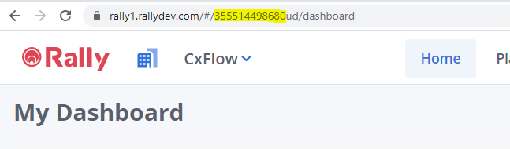
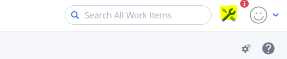

# Bug Trackers / Feedback Channels

## Understanding the Data

Checkmarx results are processed according to the following
schema [cx.xsd](attachments/1276543114/1279492127.xsd)

The breakdown of the XML includes :

Query→ Result→ Path 

Issues are filtered based on the criteria found in the main
configuration of CxFlow along with any particular overrides (severity,
category, cwe, status).  From the XML structure, the
**Source** identifier is the main tracking element. 
**Vulnerability+File** path is the key, and as additional line
references are found for the same key, it is appended to the same issue
reference.  See the development section for details on the
ScanResults/Issue object structure.

*In the future, the best fix location would be a more appropriate value
to track, but is unavailable at this time.*

### False Positives

The feedback channels will represent only 

## Jira

Jira has the most complex configuration use case as there is support for
custom fields, custom workflows and custom transitions.

``` java
jira:
  url: https://xxxx.atlassian.net
  username: xxxx
  token: xxxx
  project: SS
  issue-type: Application Security Bug
  priorities: 
    High: High
    Medium: Medium
    Low: Low
    informational: Lowest
  open-transition: In Review
  close-transition: Done
  open-status:
    - To Do
    - In Progress
    - In Review
  closed-status:
    - Done
  fields:
#   - type: cx #[ cx | static | result ]
#     name: Platform # cx custom field name | cwe, category, severity, application, *project*, repo-name, branch, repo-url, namespace, recommendations, loc, site, issueLink, filename, language
#     jira-field-name: Application
#     jira-field-type: label #[ security | text | label | single-select | multi-select ]
    - type: result
      name: application
      jira-field-name: Application
      jira-field-type: label
    - type: result
      name: cve
      jira-field-name: CVEs
      jira-field-type: label
    - type: result
      name: cwe
      jira-field-name: CWEs
      jira-field-type: label
    - type: result
      name: category
      jira-field-name: Category
      jira-field-type: label
    - type: result
      name: loc
      jira-field-name: LOC
      jira-field-type: label
      jira-default-value: XXXXX
```

### Priorities

``` java
  priorities: 
    High: High
    Medium: Medium
    Low: Low
    informational: Lowest
```

The value on the left is the Checkmarx severity \| The value on the
right is the priority assigned to the issue in Jira

### Transitions

It is very important that issues driven by CxFlow have the ability to
transition to and from the open/close transition states regardless of
what state the issue is in.  In the event an issue cannot use the
appropriate transition defined, it will fail.

``` java
  open-transition: In Review
  close-transition: Done
  open-status:
    - To Do
    - In Progress
    - In Review
  closed-status:
    - Done
```

-   open-transition → this is the transition to apply to an issue when
    **re-opening** an issue 
-   close-transition → this is the transition to apply to an issue when
    **closing** an issue 
-   open-status → this is a list of the available status an issue can be
    in that indicate the issue is still in **open** state according to
    Jira
-   closed-status → this is a list of the available status an issue can
    be in that indicate the issue is still in **closed** state according
    to Jira

### **Fields**

-   ***type*:**

    -   **static:** Used for static values (specifically requires
        jira-default-value to be provided)
    -   **cx:** Used to map specific Checkmarx Custom Field value
    -   **result:** Used to map known values from checkmarx results or
        repository/scan request details.  See Result values below. \|

-   ***name*:** When cx is the type, this is the name of the custom
    field within Checkmarx

    -   When **result** is provided as the ***type**, the **name*** must
        be one of the following:

        ``` java
            application - Command line option --app
            project - Command line option --cx-project
            namespace - Command line option --namespace
            repo-name - Command line option --repo-name
            repo-url - Command line option --repo-url
            branch - Command line option --branch
            severity - Severity of issue in Checkmarx
            category - Category of issue in Checkmarx
            cwe - CWE of issue in Checkmarx
            recommendation - Recommendation details based on Mitre/Custom Wiki
            loc - csv of lines of code
            issue-link - Direct link to issue within Checkmarx
            filename - Filename provided by Checkmarx issue
            language - Language provided by Checkmarx issue
            similarity-id - Cx Similarity ID
        ```

<!-- -->

-   **jira-field-name** - Custom field name in Jira (readable name, not
    custom field ID)
-   **jira-field-type** - Type of custom field in JIRA:
    -   *label* (if using static or cx values, csv format is used and
        broken into multiple labels)
    -   *text* (applies to many custom field types: url, text box, text,
        etc
    -   *multi-select* (csv format is used and broken into multiple
        select values)
    -   *single-select*
    -   *security* (used for issue security levels)
-   **jira-default-value** - Static value if no value can be determined
    for field (Optional)

## Custom Bug Trackers

See [development section](Development) regarding the implementation
approach to the following.

To use one of the Custom Bug Trackers, the cx-flow tag within the
application yaml config must have the specified Spring Boot bean under
bug-tracker-impl:

``` java
cx-flow:
  contact: admin@cx.com
  bug-tracker: Json
  bug-tracker-impl:
    - CxXml
    - Csv
    - Json
    - GitLab
    - GitHub
```

Valid options for bug-tracker-impl are currently:

-   CxXML 
-   Csv
-   Json
-   GitHub
-   GitLab
-   Azure

## Azure DevOps WorkItems

Azure DevOps workitems only support an issue body/description. 
Custom/tempate field values are not available at this time.  The
available issue-type values are built/tested around issue and impediment
(Scrum)


## GitLab Issues

GitLab Issues leverages the same configuration as specified for WebHook
listeners → API token (**token)** and valid urls are required

``` java
gitlab:
  webhook-token: XXXX
  token: xxx
  url: https://gitlab.com
  api-url: https://gitlab.com/api/v4/
  false-positive-label: false-positive
  block-merge: true
```


### GitHub Issues

GitHub Issues leverages the same configuration as specified for WebHook
listeners → API token (**token)** and valid urls are required

``` java
github:
  webhook-token: xxxx
  token: xxxx
  url: https://github.com
  api-url: https://api.github.com/repos/
  false-positive-label: false-positive
  block-merge: true
```


  

## Rally Issues

Rally Issues require the following configuration. In addition to the API
security token the Rally API requires that you provide both a project ID
and a work space ID. The Rally plugin uses tags to track defects. 

``` java
rally:
  token: xxxx
  rally-project-id: xxxx
  rally-workspace-id: xxxx
  url: https://rallydev.com
  api-url: https://rally1.rallydev.com/slm/webservice/v2.0
```

  

Sample Rally Issue:


Finding Rally Project and Workspace IDs can be tricky but the easiest is
to find the values is by looking at the URLs in you browser. There
aren't any screens that directly expose the values. 

To find the Project ID, simply log into Rally and you will be taken to
your default project. If you look at the URL you will see the Projects
OID, example:  
  


Remember projects are associated with workspaces and you can find the
workspace setup from the projects screen. Simply go to setup by click on
the wrench icon in the upper right-hand corner, example:



From the setup screen click on 'Workspaces & Projects', you will see a
list of workspaces, example:


Click on the workspace your are interesting in, in this case
***Checkmarx***. You will be taken to the Workspace setup screen and now
you find the associated OID by looking at the URL, example:


If you are logged into Rally, you can generate your API token
[here](https://rally1.rallydev.com/login/accounts/index.html#/keys).
From this screen press 'Create New API' key, example:


From the screen, just name your key and give it 'Full Access':

  


The API key will be created and you will see the token on the API Keys
screen. Now you should have all the information you need to configure
the Rally bug tracker. 

## CxXML

The XML bug-tracker (defined as CxXml), is useful if you would like to
retrieve all of the latest scan results per project (batch mode) from
Checkmarx per project, Team, or entire instance.  This is the original
XML report provided from Checkmarx.  It is important to note that the
checkmarx config block must specify preserve-xml to be true for this
feedback type.

``` java
checkmarx:
  ...
  ...
    preserve-xml: true

cx-xml:
  file-name-format: "[NAMESPACE]-[REPO]-[BRANCH]-[TIME].xml"
  data-folder: "C:\\tmp"
```

The file system path as well as the file naming format is required.

## Json

The JSON bug-tracker (defined as Json), is useful if you would like to
retrieve all of the latest scan results per project (batch mode) from
Checkmarx per project, Team, or entire instance.  This is the JSON
representation of the ScanResults object, which include issues based on
the filtering specified in the main config block (cx-flow).

``` java
json:
  file-name-format: "[NAMESPACE]-[REPO]-[BRANCH]-[TIME].xml"
  data-folder: "C:\\tmp"
```

The file system path as well as the file naming format is required.

## Csv

  

``` java
checkmarx:
  ...
  ...
    preserve-xml: true

cx-xml:
  file-name-format: "[NAMESPACE]-[REPO]-[BRANCH]-[TIME].xml"
  data-folder: "C:\\tmp"
```

The file system path as well as the file naming format is required.

  

NOTE: All of the file based outputs have a file-name-format attribute,
which allows for dynamic naming substitution.  File name follows a
substitution pattern with the following elements:

\[APP\] → Application

\[TEAM\] → Checkmarx Team ( \\ is replaced with \_ in the filename)

\[PROJECT\] → Checkmarx Project \[PROJECT\] → Checkmarx Project

\[NAMESPACE\] → Checkmarx Project \[PROJECT\] → Org/Group/Namespace for
the repo (if available)

\[REPO\] → Checkmarx Project \[PROJECT\] → Repository name (if
available)

\[BRANCH\] → Checkmarx Project \[PROJECT\] → Branch name (if available)

\[TIMESTAMP\] → Current timestamp (yyyyMMdd.HHmmss format)

  

## NONE \| WAIT

If you would like to trigger scans asynchronously, then use NONE

If you would like to trigger scans, but wait for feedback \| summary
console output, then use WAIT \| wait

## Attachments:


[cx.xsd](attachments/1276543114/1279492127.xsd)
(application/octet-stream)  

[image2019-5-7\_20-42-35.png](attachments/1276543114/1279852551.png)
(image/png)  

[CxFlow-GitHubIssue.png](attachments/1276543114/1279852840.png)
(image/png)  

[image2019-6-24\_16-5-45.png](attachments/1276543114/1308754093.png)
(image/png)  
 [rally
capture.PNG](attachments/1276543114/1573617732.png) (image/png)  

[rally\_project\_id.PNG](attachments/1276543114/1571848446.png)
(image/png)  

[rally\_setup.PNG](attachments/1276543114/1573355636.png) (image/png)  

[rally-workspaces.PNG](attachments/1276543114/1572896968.png)
(image/png)  

[rally\_workspace\_id.PNG](attachments/1276543114/1573322866.png)
(image/png)  

[rally\_keys.PNG](attachments/1276543114/1573257400.png) (image/png)  

[rally\_key\_create.PNG](attachments/1276543114/1573584997.png)
(image/png)  
