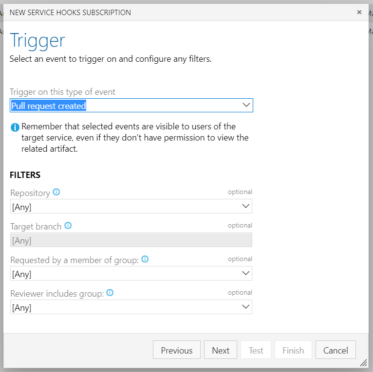
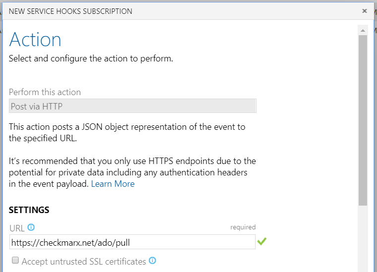
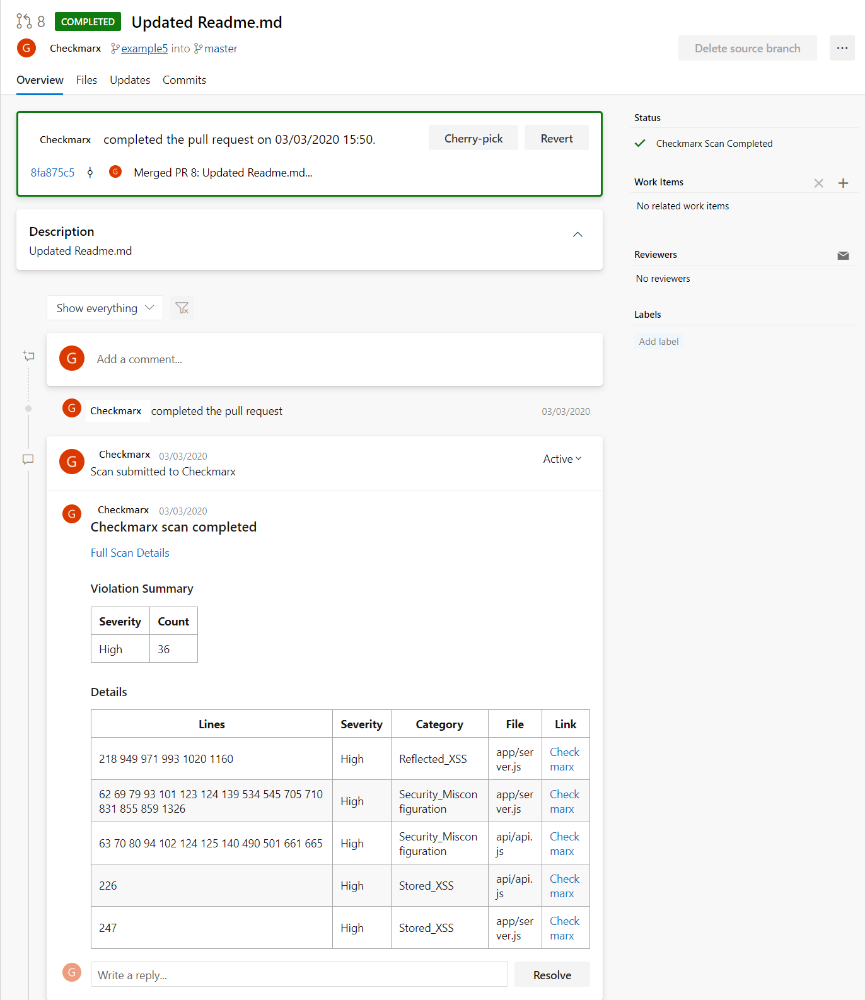
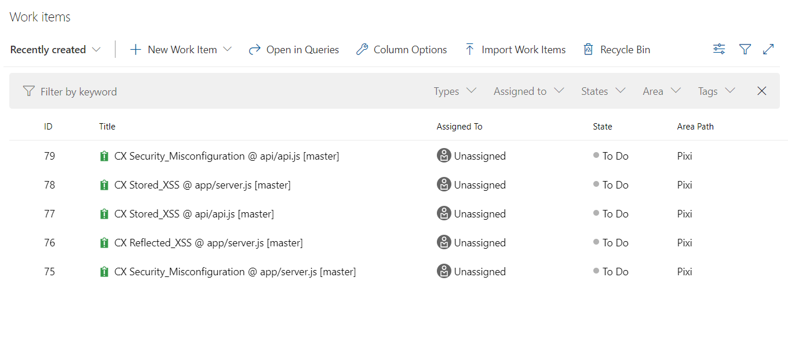
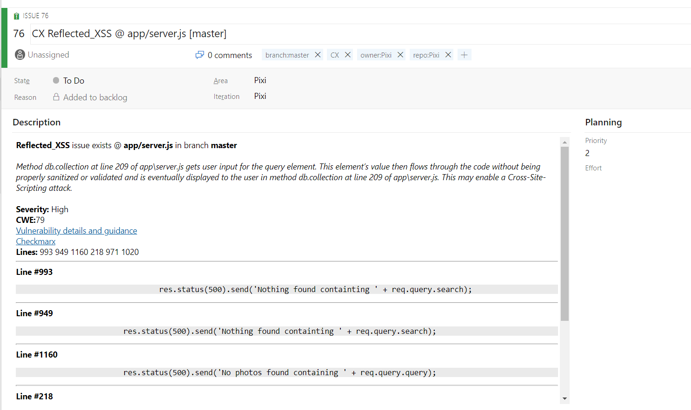

# CxFlow Azure DevOps Web Hook Integration

-   [CxFlow
    Requirements](#CxFlowAzureDevOpsWebHookIntegration-CxFlowRequirements)
    -   [IP/Domain Name
        Whitelisting](#CxFlowAzureDevOpsWebHookIntegration-IP/DomainNameWhitelisting)
-   [CxFlow
    Configuration](#CxFlowAzureDevOpsWebHookIntegration-CxFlowConfiguration)
    -   [Azure DevOps Access
        Token](#CxFlowAzureDevOpsWebHookIntegration-AzureDevOpsAccessToken)
    -   [Web Hook Event
        Overrides](#CxFlowAzureDevOpsWebHookIntegration-WebHookEventOverrides)
    -   [Scripting
        (Groovy)](#CxFlowAzureDevOpsWebHookIntegration-Scripting(Groovy))
-   [Pull Request
    Events](#CxFlowAzureDevOpsWebHookIntegration-PullRequestEvents)
    -   [Setting up the Web Service
        Hook](#CxFlowAzureDevOpsWebHookIntegration-SettinguptheWebServiceHook)
        -   [Testing](#CxFlowAzureDevOpsWebHookIntegration-Testing)
-   [Push Events](#CxFlowAzureDevOpsWebHookIntegration-PushEvents)
    -   [Testing](#CxFlowAzureDevOpsWebHookIntegration-Testing.1)

## CxFlow Requirements

Please read the CxFlow Configuration
[pre-requisites](https://checkmarx.atlassian.net/wiki/spaces/PTS/pages/1276019198/Pre-Requisites+Requirements)
for more details.

### IP/Domain Name Whitelisting

Due to the nature of Web Hooks, CxFlow will need to receive REST API
calls from Azure DevOps when a particular events are executed. This will
require exposure of CxFlow’s API to Azure DevOps to allow this incoming
connection. We recommend that when opening this port to Azure DevOps an
organisation will need to perform IP or Domain Whitelisting. Microsoft
does provide a documentation on [white listing their services
here](https://docs.microsoft.com/en-us/azure/devops/organizations/security/allow-list-ip-url?view=azure-devops).

## CxFlow Configuration

Please read the CxFlow [configuration
common](https://checkmarx.atlassian.net/wiki/spaces/PTS/pages/1276641334/CxFlow+Configuration#CxFlowConfiguration-ConfigurationDefinitions)
and [Azure
DevOps](https://checkmarx.atlassian.net/wiki/spaces/PTS/pages/1276641334/CxFlow+Configuration#CxFlowConfiguration-AzureDevOps)
sections.

### Azure DevOps Access Token

The Azure Access Token that needs to be configured with CxFlow needs to
have the following requirements for both Push and Pull Request events:

-   Code (Read & write)

-   Work Items (Read, write, & manage)

Tokens only have a life cycle of 365 days maximum so having a secret
rotation cycle in place is very important in the long term.

Tokens only have a life cycle of 365 days maximum so having a secret
rotation cycle in place is very important in the long term.

### Web Hook Event Overrides

In some cases, you maybe required to override properties for the web
hook to accommodate a particular requirement (Checkmarx Project name
different, Checkmarx Team used, etc.). Please take a look at the
[Parameter
Override](https://checkmarx.atlassian.net/wiki/spaces/PTS/pages/1276641334/CxFlow+Configuration#CxFlowConfiguration-WebHookURLOverrideParameters-Details(relatedtoabove))
section in CxFlow configuration page.

### Scripting (Groovy)

For more complex and automated tasks, please take a look at the
[external Groovy
scripting](https://checkmarx.atlassian.net/wiki/spaces/PTS/pages/1276641334/CxFlow+Configuration#CxFlowConfiguration-ExternalScripting)
abilities CxFlow offers ([example on
GitHub](https://github.com/checkmarx-ts/cx-flow/blob/develop/src/main/resources/samples/CxProject.groovy)).

## Pull Request Events

The Pull Request integration allows for both the scanning of code
created in a Pull Request by a developer and decorating the Pull Request
with the vulnerabilities found in the code.

Due to how developers create and define ADO Services Hooks, if you want
to decorate pull requests and create Work Items you will need to create
two web hooks based on different event triggers (see below). Work Items
will only be created in the event of a Push events to a protected branch
(example: master, develop, etc.)

### Setting up the Web Service Hook

When creating a Web Hook, you’ll need to create trigger on the “Pull
request created” or “Code pushes” event along with any filters that an
organisation may require (this can also be done in CxFlow with protected
branches feature).

Next, you’ll need to [configure the Web
Hook](https://checkmarx.atlassian.net/wiki/spaces/PTS/pages/1277722692/WebHook+Registration#WebHookRegistration-AzureDevOps)
action to point to the CxFlow instance which is deployed plus an
additional suffix of `/ado/pull` which signifies that this request is
from Azure DevOps and is a Pull Request. An example complete URL would
be `https://checkmarx.net/ado/pull`.

This will also require username and password used to authenticate to
CxFlow. This is used as an authentication check to make sure that the
connecting is an authenticated user.

#### Testing

To test the integration was successful, you will be required to create a
Pull Request event.

## Push Events

Push events occur when code is pushed into the remote (Azure DevOps)
repository.

### Testing

To test if the configuration was successful, you will need to create a
new commit and push to the remote repository. This can be done quickly
via the web user interface in ADO by editing and committing to a branch.
This will create a Push event to be sent to CxFlow for scanning (the
logs can be observed to verify the event was triggered.

If nothing occurs, please check the requirements section as the CxFlow
endpoint might be blocked from where the web hook is being sent from.

Once the event has completed, CxFlow will have created Work Items in
Azure DevOps for the project that created the Pull Request. See below as
an example.

If you navigate inside one of the Work Items you’ll see all of the
details provided by CxFlow and Checkmarx SAST inline in the Work Item.

## Attachments:

[image-20200312-132439.png](attachments/1587576949/1597276218.png)
(image/png)  

[image-20200312-132854.png](attachments/1587576949/1597964367.png)
(image/png)  

[PullRequest.PNG](attachments/1587576949/1612349545.png) (image/png)  

[image-20200317-125525.png](attachments/1587576949/1612349573.png)
(image/png)  

[image-20200317-125612.png](attachments/1587576949/1610088845.png)
(image/png)  

[AccessToken.PNG?version=1&modificationDate=1584528151806&cacheVersion=1&api=v2](attachments/1587576949/1614119377)
(image/png)  
