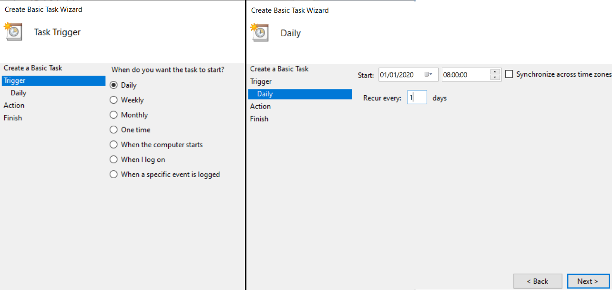
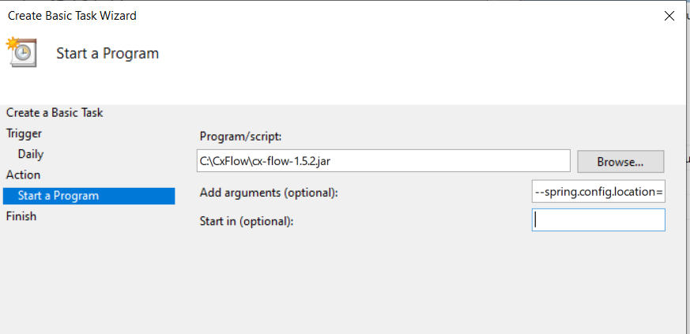

# CxFlow Nightly Batch Mode

## Windows - Creating Schedules Tasks

In Windows, the Task Scheduler is a built “Con Job” like service that
will execute the tasks periodically. To create a daily/nightly jobs,
Open Task Scheduler and select “Create Basic Task…” on the right hand
side (as shown below).

Set the name of the Task to “CxFlow”, click Next. Select the required
scheduled time. The example below is Daily at 8AM.

Once selected the required schedule, select the “Start a Program” which
will execute any script or program we wish. Navigate to either the JAR
file or a PowerShell script that you want to use for executing CxFlow
and configure the arguments you may need to pass in to the task at run
time.

Process to completing the setup.

## Attachments:

[image-20200205-112147.png](attachments/1490026799/1497104503.png)
(image/png)  

[image-20200205-113212.png](attachments/1490026799/1497202772.png)
(image/png)  

[image-20200205-152031.png](attachments/1490026799/1496580468.png)
(image/png)  

[image-20200205-152034.png](attachments/1490026799/1493796106.png)
(image/png)  

[image-20200205-152034.png](attachments/1490026799/1496580476.png)
(image/png)  
