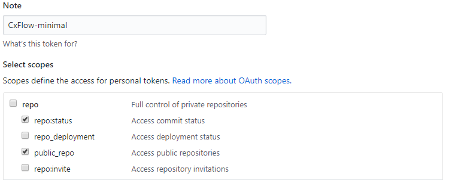

# Github Webhook Lab

**Lab Goals**

This lab is designed to teach the following topics:

-   How to scan on a Pull Request to a Protected Branch

-   How to scan on a Push to Protected Branch

-   Github Issue Creation on Push to Protect Branch

**CxFlow Prep**

-   Everything should be performed on the same machine that the CxSAST
    Manager is running for this lab

    -   Alternatively, do this on your local machine and change
        checkmarx base-url: in the .yml file to something that GitHub
        can reach example: <https://cxprivatecloud.checkmarx.net/>

-   Create a new folder in C:\\ called CxFlow and download the latest
    CxFlow .jar for JDK 8 into this folder from
    <https://github.com/checkmarx-ts/cx-flow/releases>

    -   The current release of this lab guide =  cx-flow.1.5.4.jar

-   Download the latest windows version of ngrok from
    <https://ngrok.com/download> & unzip to C:\\CxFlow without the
    containing folder

-   Create a new file called application-github.yml in C:\\Flow with the
    text at the bottom of the page and replace any values surrounded in
    \#\#\#\<\>\#\#\# with your appropriate values

-   Go over all of the config items and read what they do

    -    [CxFlow Configuration](CxFlow_Configuration)

-   Start Ngrok by opening a CMD prompt and typing the following

``` java
cd C:\CxFlow
ngrok http 8982
```

**Github Prep**

-   Create an account at [www.github.com](http://www.github.com) with
    your Checkmarx email

-   Create a new public repository called CxFlowGithub

-   Import code from your favorite small demo codebase on github

    -   This lab will use - <https://github.com/psiinon/bodgeit>

-   Create a token by clicking your profile in upper right
    corner \>settings

    -   Click Developer settings\>Personal Access Tokens\>Generate New
        Token

    -   Give the token a note/name, repo:status and public\_repo under
        the repo section

-   Ensure “Issues” are enabled on the project
    (Settings\>General\>Features\>Issues



-   Copy this token and keep safe - it should be pasted into the token:
    \<\> of the application-github.yml

<!-- -->

-   After .YML file is completely filled out and saved

-   Start CxFlow in webhook mode by opening a CMD prompt and typing the
    following

``` java
cd C:\CxFlow
java -jar cx-flow-1.5.4.jar --spring.config.location="C:\CxFlow\application-github.yml" --web
```

-   Create a webhook by selecting your profile and click your
    repositories followed by the repo you just created

    -   [WebHook Registration](WebHook_Registration)

    -   Click settings\>Webhooks\>Add Webhook and fill in details

        -   Payload URL = ngrok location of cxflow that is running -
            example: <http://4d91e7ed.ngrok.io>

        -   Content type = application/json

        -   Secret = webhook-token: from .yml file - example: 12345

        -   Let me select events - Pull Requests, Pushes

        -   Click Add Webhook - there should be a checkmark next to the
            hook name now

**Triggering CxFlow from a Push to a protected branch (master)**

-   Open your favorite IDE of choice and clone the new repo

    -   This lab will use Intellij & the repo -
        <https://github.com/scxbush/CxFlowGithub>

        -   Open IntelliJ, click Check out from Version Control and
            input above URL, select next until done

    -   Open [README.md](http://README.md) and add the following line &
        save

        -   CxFlowMasterPush-Test1

    -   Commit to local git repo & push to origin with comments by
        clicking the following

        -   VCS\>Git\>Commit File & enter the following commit message

        -   Cxflow push to a protected branch

        -   Click commit & push

        -   Click Push & enter Github credentials on popup

            -   Username = username

            -   Password = token created

-   You should now see a scan in the CxSAST queue

    -   Notice the project name = RepoName-Branch

    -   Notice the team of the new project = GitHub organization

        -   This is due to the team line in the .yml file - it
            auto-creates a team if it does not exist

        -   This can be overridden and changed in the configs

-   Once the scan finishes you should see issues in the issue tab on
    your GitHub project

    -   https://github.com/\<youraccountname\>/CxFlowGithub/issues

    -   Examine the following issue CX SQL\_Injection @ root/basket.jsp
        \[master\]

    -   Open the Checkmarx link and examine the finding

**Triggering CxFlow from a Pull Request to a protected branch
(security-fix to master)**

-   Open Intellij and create a new local branch called security-fix

    -   Click VCS\>Git\>Branches\>New Branch

    -   Type "security-fix" and click ok

-   Open basket.jsp underneath the root folder and replace lines 53-55
    with the following

``` java
//Statement stmt = conn.createStatement();
//Security Fix
PreparedStatement preparedStatement = con.prepareStatement(sql);
try {
//ResultSet rs = stmt.executeQuery("SELECT * FROM Baskets WHERE basketid = " + basketId);
String sql = "SELECT * FROM Baskets WHERE basketid =?");
preparedStatement.setString(1, basketId);
ResetSet rs = preparedStatement.executeQuery();
```

-   Add the following on line 7 to import the correct package

``` java
<%@ page import="java.sql.PreparedStatement" %>
```

-   Alternatively, you can pull down results using the CxViewer in
    Intellij and remediate based on the ID

-   Save the file, commit to the local repo and push to origin

    -   Click File \> Save All

    -   Click VCS\>Git\>Commit File & add commit message "added
        preparedstmt on line 55"

    -   Click Commit and Push followed by Push

-   Go to Github and click pull requests & click Compare & pull
    request\>Create pull request

    -   Alternatively in IDE - click VCS\>Create Pull Request

-   Notice in GitHub that some checks haven't been completed yet -
    Checkmarx Scan

-   Notice a new scan in CxSAST with Project name = RepoName-Branch

    -   Once the scan finishes, you can see the post in the Github merge
        pull request comments with all the vulnerabilities found

    -   Notice that the basket.jsp SQLi is gone
        

    -   Click Merge Pull Request\> Confirm Merge to accept the risk
        CxSAST has posted about in the comments

-   Notice a new scan in CxSAST with Project name = RepoName-Branch for
    the master branch

-   Go back to the GitHub issues page and note that there are only 15
    issues remaining

-   Go to CxSAST and note that CxFlowGithub-master project has solved
    issues and recurrent issues

**To Demo**

-   Save & cleanup C:\\CxFlow\\flow.log to for showing what happens via
    automation

-   Do not delete the pull request branch or modify the projects

-   Change branches in IntelliJ in the bottom right corner and force
    checkout as long as you don’t clone again

-   Walk back through the workflow without the setup to show demo

The below YAML file is for 8.9 - please update using directions on
[Workflow Labs & Guides](Workflow_Labs_Guides) for 9.0

x

## Attachments:


[image-20200310-124121.png](attachments/1561920248/1591050379.png)
(image/png)  
